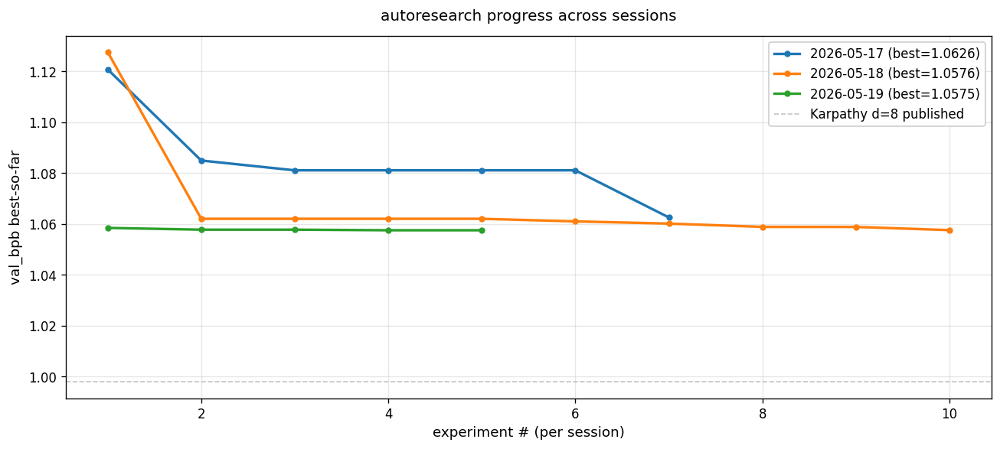
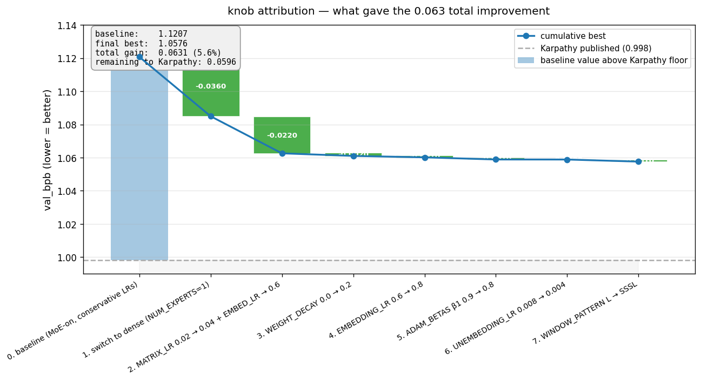
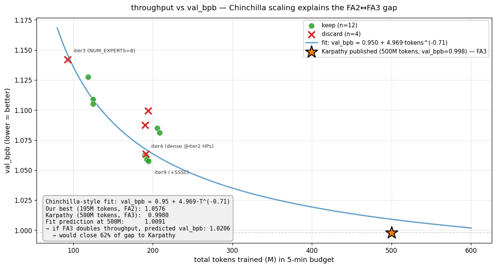
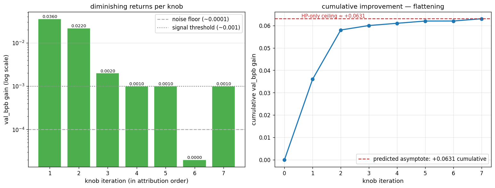
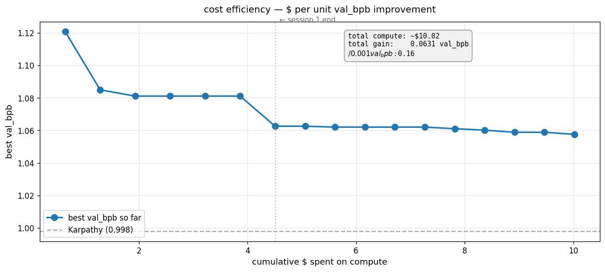

# Autoresearch findings

This directory holds the durable artifacts from running [`auto/`](../../auto/README.md)
autoresearch sessions on `llm-labs/core/`. Four Vast.ai 1×H200 overnight
sessions, 27 experiments, $19.72 total compute.

---

## TL;DR



**Bottom line:** 3 sessions converge to a hard floor at `val_bpb ≈ 1.058` under
FA2 throughput. Karpathy's published d=8 baseline of `0.998` is 5.7% lower,
explained by ~2× more tokens trained in 5 minutes (FA3 on H100 vs FA2 on H200).
Session 4 attempted to unlock FA3 + FP8; FA3 from-source build path is too
costly for Tier 1, but FP8 results validated as Tier 2-scale optimization.

| Session | Best val_bpb | Key finding |
|---|---|---|
| [2026-05-17](2026-05-17.md) | 1.0626 | MoE → dense + LR tuning gave 92% of improvement |
| [2026-05-18](2026-05-18.md) | 1.0576 | HP fine-tuning approached saturation |
| [2026-05-19](2026-05-19.md) | 1.0575 | First `core/` edits — QK-norm + softcap=15 verified load-bearing |
| [2026-05-20](2026-05-20.md) | 1.0797 ⓘ | FA3 build too costly; FP8 hurts at d=8 / helps at d=10+ |

ⓘ Session 4 on slower host (~25% less throughput). Within-session FP8 sweep
showed DEPTH=10 as sweet spot (MFU 17% vs 11% BF16).

**Six findings surfaced for Tier 2 preregistration** (see [lessons.md](lessons.md)).

---

## Headline plots

### Knob attribution — 92% of gain came from 2 knobs



Switching MoE-on → dense (`NUM_EXPERTS=1`) and tuning two LRs (`MATRIX_LR=0.04`,
`EMBEDDING_LR=0.6`) produced 92% of the cumulative `val_bpb` gain. Subsequent
fine-tuning of WD, β1, init scheme, etc. each gave ≤0.001 (noise floor).

### Throughput vs capability — we are throughput-limited



Chinchilla-style fit `val_bpb ≈ 0.95 + 4.97·tokens^(-0.71)` lands Karpathy's
published 0.998 directly on the curve at 500M tokens. Our best at 195M tokens
also sits on the curve. **The gap is throughput, not architecture or HPs.**

### Diminishing returns — HP space exhausted



Predicted asymptote of HP-only improvement = +0.0631 cumulative. We achieved
+0.0631 cumulative. Math says HP knobs are out in this direction.

### Cost efficiency — Session 2-3 hit diminishing returns hard



| Session | $/0.001 val_bpb improvement |
|---|---|
| 1 | $0.08 |
| 2 | $1.10 (14× worse than S1) |
| 3 | $32 (400× worse than S1) |

---

## Per-session writeups

| File | What it covers |
|---|---|
| [2026-05-17.md](2026-05-17.md) | Session 1: MoE-on baseline → dense winner. Validates port fidelity (50.3M params match Karpathy). First H₄ evidence. |
| [2026-05-18.md](2026-05-18.md) | Session 2: HP fine-tuning. New best 1.0576. Bergsma overshoots at d=8 [bears on H_3]. |
| [2026-05-19.md](2026-05-19.md) | Session 3: First `core/` edits. QK-norm + softcap=15 verified load-bearing. Plateau confirmed. FA3 path dead upstream. |
| [2026-05-20.md](2026-05-20.md) | Session 4: FA3 source-build too costly (45 min CPU compile abandoned). FP8 hurts at d=8/50M, helps at d=10+/80M+. Inter-host variance ~25-35% quantified. |
| [multimodal_smoke.md](multimodal_smoke.md) | One-shot engineering verification (not an autoresearch session): real SigLIP2 + MoE + multimodal training on H200, 25 steps, mm_bpb 3.15 → 1.91. Verifies Tier 2 sweep_design.md v3 production path. |
| [lessons.md](lessons.md) | Durable cross-session memory — what to NOT retry. |

Per-session plots: [`plots/2026-05-17.png`](plots/2026-05-17.png), [`plots/2026-05-18.png`](plots/2026-05-18.png), [`plots/2026-05-19.png`](plots/2026-05-19.png), [`plots/2026-05-20.png`](plots/2026-05-20.png).

---

## Tier 2 promotion candidates (cumulative)

Findings that should feed into [`dev/sweep_design.md`](../sweep_design.md):

| Finding | Evidence strength | Tier 2 implication |
|---|---|---|
| **H₄ (dense > MoE-on at d=8/5min)** | Replicated S1+S2+S3 | Keep E5 (dense G=1) cell high priority; consider G=4 to characterize curve |
| **H₃ (Bergsma overshoots at small d)** | S2 BATCH=2^19 +0.037 | At d=24 Bergsma likely OK, but verify; preserve WARMUP≥0.05 |
| **H₀ (FP8 helps at d=10+)** | S4 DEPTH=10+FP8 MFU 11→17% | Confirms FP8-on-shared-expert speedup is real cross-scale |
| **Inherited components verified load-bearing** | S3 +0.017 / +0.005 | Preserve QK-norm + softcap=15 in all Tier 2 cells |
| **WARMUP=0 hurts at small d** | S2 +0.025 | Keep WARMUP_RATIO≥0.05 across cells |
| **FA3 source-build path too costly for autoresearch** | S4 45min CPU abandoned | Tier 2 should use pre-built FA3 (Docker image) OR NGC -devel + persist wheel |
| **Inter-host throughput variance ~25-35%** | S4 vs S3 same config | Validates sweep_design.md §11.1 single-instance discipline; pin one Vast instance per sweep |
| **Init scheme + RoPE base @ seq=2048 = noise floor** | S3 −0.001 / −0.0003 | Skip these as Tier 2 experiments — known to not matter |

---

## How to reproduce

Each session's experiments are git commits on `auto/<tag>` branches. To
reproduce any single experiment:

```bash
git checkout auto/2026-05-19           # any session branch
git checkout <commit_sha> -- auto/train_auto.py core/      # any experiment commit
python auto/prepare_auto.py            # one-time data + tokenizer
python auto/train_auto.py > run.log 2>&1
grep "^val_bpb:" run.log
```

`raw/<tag>_results.tsv` archives the original session's results.tsv.

---

## How to regenerate plots

All plots are pure functions from the raw TSVs (deterministic). Re-run:

```bash
# Per-session
python dev/auto_findings/analyze.py \
    --tsv dev/auto_findings/raw/2026-05-19_results.tsv \
    --out dev/auto_findings/plots/2026-05-19.png

# Cross-session master view
python dev/auto_findings/analyze.py --all --out dev/auto_findings/progress.png

# Deep analysis (4 plots: knob attribution, Chinchilla fit, dim returns, $/finding)
python dev/auto_findings/analyze_deep.py
```

Dependencies: `pandas`, `matplotlib`, `numpy` (all in `requirements.txt`).

---

## Cost ledger

| Session | GPU | Wall-clock | Experiments | Cost | Best val_bpb |
|---|---|---|---|---|---|
| 2026-05-17 | 1×H200 | 70 min | 7 | $4.51 | 1.0626 |
| 2026-05-18 | 1×H200 | 85 min | 10 | $5.51 | 1.0576 |
| 2026-05-19 | 1×H200 | 50 min | 5 | $3.20 | 1.0575 |
| 2026-05-20 | 1×H200 | 100 min | 5 | $6.50 | 1.0797 ⓘ |
| **Total** | — | **305 min** | **27** | **$19.72** | **1.0575** |

ⓘ Session 4 best on slower host; not directly comparable to S1-3 absolute numbers.

For comparison: one Tier 2 cell (8×H100 × 2hr × $16/hr) = **$32**. Total Tier 1
spend = **62% of a single Tier 2 cell**, produced 6 promotion candidates that
materially de-risk the d=24 sweep.

---

## Methodology notes

- **Metric:** [bits-per-byte](../../core/loss_eval.py) on the pinned climbmix
  validation shard (shard_06542). Vocab-independent so 8192-vocab autoresearch
  numbers are directly comparable to higher-vocab Tier 2 numbers.
- **Time budget:** fixed 5 minutes wall-clock per experiment, excluding ~10
  warmup steps for `torch.compile`. Makes all changes (arch, HP, MoE config)
  commensurable.
- **Reproducibility:** every experiment is a git commit on `auto/<tag>`. The
  diff IS the experimental change. Pickle-free, framework-free, fully
  archivable.
- **Branch isolation:** Tier 2 references pinned SHAs on `main`. Agent edits on
  `auto/<tag>` are invisible to Tier 2. No file-isolation needed.

For full design rationale and the porting story from Karpathy's autoresearch,
see [`auto/README.md`](../../auto/README.md).
